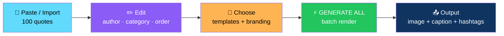
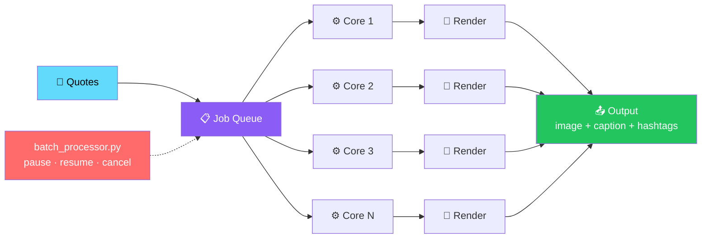

# 🖼️ QuoteBatch Studio

<div align="center">


**Turn your quotes into beautiful posts — in bulk.**

*Paste 100 quotes → choose templates → click **GENERATE ALL** → get 100 ready-to-post images*

[✨ Features](#-features) • [🏗️ Architecture](#️-architecture) • [🚀 Install & Run](#1-install) • [🎨 Customization](#-adding-your-own-fonts) • [📦 Packaging](#-packaging-a-windows-exe)

</div>

---

## 📖 Overview

**QuoteBatch Studio** is a **desktop app** *(Python + PySide6)* for creators who need to turn **dozens or hundreds of quotes** into polished, on-brand social-media images **in one batch**.

### Core Idea

> **Paste 100 quotes. Click Generate All. Get 100 ready-to-post images.**
>
> Each image comes with a matching caption + hashtag file. Runs fully offline — no API keys, no internet connection required.

### The Flow



---

## ✨ Features

<div align="center">

| 📥 Import | ✏️ Full Quote Editor |
|:---:|:---:|
| Paste quotes · import `.txt` / `.csv` / `.json` | Edit · delete · duplicate · reorder · select/deselect · author · category |
| **🎨 10 Built-In Templates** | **🔧 Template Creator** |
| Minimal · Cinematic · Nature · Gradient · Luxury · Soft · Bold · Photo · Editorial · "One More Step" (branded) | Visual editor — add text, image, logo, rectangle, circle, or gradient elements |
| **🎲 Template Selection Modes** | **🖼️ Backgrounds** |
| Fixed · Random · Rotate · **Smart** *(rule-based, no AI required)* | Local photo folders with auto-categories — or generated built-in art if you don't supply your own |
| **📐 Smart Text Fitting** | **🔤 Full Typography Controls** |
| Quotes always fit — never overflow, never get cut off | Font family · size · weight · letter/line spacing · alignment · color · opacity |
| **🏷️ Branding** | **📏 Social Sizes** |
| Name · per-word color *(e.g. **ONE** red / **MORE** white / **STEP** blue)* · logo · placement · opacity | 1080×1080 · 1080×1350 · 1080×1920 · 1200×630 · custom |
| **👁️ Live Preview** | **🔢 Multiple Variations** |
| Updates as you edit | 1 / 3 / 5 / 10 variations per quote across different templates |
| **⚙️ Batch Control** | **📁 Organized Output** |
| Progress bar · time estimate · pause / resume / cancel · resume after interruption | `output/<date>/` · `captions/` · `previews/` |
| **📛 Smart Filenames** | **💬 Caption Generator** |
| Brand+number, or derived from the quote text | Offline, rule-based — captions and hashtags |
| **💾 Project Save/Open** | **🌐 Fully Offline** |
| `.qbsproj` remembers quotes, templates, branding, output settings | No API keys, no internet connection required |

</div>

### Detailed Feature List

#### 📥 Input

- **Paste quotes** directly
- **Import** from `.txt` / `.csv` / `.json`

#### ✏️ Quote Editor

- Edit
- Delete
- Duplicate
- Reorder
- Select / deselect
- Set author and category

#### 🎨 Templates

- **10 built-in templates** — Minimal, Cinematic, Nature, Gradient, Luxury, Soft, Bold, Photo, Editorial, and a branded **"One More Step"** template
- **Visual Template Creator** — build your own

#### 🎲 Template Selection

| Mode | Behavior |
|------|----------|
| **Fixed** | Always use the same template |
| **Random** | Pick randomly per quote |
| **Rotate** | Cycle through templates in order |
| **Smart** | **Rule-based** — picks a fitting template based on quote characteristics. **No AI required** |

#### 🖼️ Backgrounds

- **Local background photo folders** with automatic categories:
  - `backgrounds/nature/`
  - `backgrounds/ocean/`
  - *(and any sub-folder you create)*
- **Or** generated built-in background art if you don't supply your own photos

#### 📐 Smart Text Fitting

> **Quotes always fit — never overflow, never get cut off.**
>
> Even extremely long quotes render completely, just smaller.

#### 🔤 Typography

Full control over:

- Font family / preset
- Size
- Weight
- Letter spacing
- Line spacing
- Alignment
- Color
- Opacity

#### 🏷️ Branding

- **Name**
- **Per-word color** — e.g. **ONE** red / **MORE** white / **STEP** blue
- **Logo**
- **Placement**
- **Opacity**

#### 📏 Output Sizes

- **1080×1080** — Instagram square
- **1080×1350** — Instagram portrait
- **1080×1920** — Stories / Reels
- **1200×630** — Open Graph / Facebook
- **Custom**

#### 👁️ Live Preview

Updates as you edit.

#### 🔢 Variations

Generate **1 / 3 / 5 / 10 variations** per quote across different templates.

#### ⚙️ Bulk Generation

- **Progress bar**
- **Time estimate**
- **Pause / resume / cancel**
- **Resume after interruption**

#### 📁 Organized Output

```
output/<date>/
├── captions/
└── previews/
```

#### 📛 Smart Filenames

- **Brand + number** — e.g. `onemorestep_0001.png`
- **Or derived from the quote text**

#### 💬 Caption + Hashtag Generator

**Offline, rule-based** — no API calls.

#### 💾 Export

**PNG · JPG · WEBP** with quality control.

#### 📦 Project Save / Open

**`.qbsproj`** remembers:

- Quotes
- Templates
- Branding
- Output settings

#### 🌐 Fully Offline

**No API keys. No internet connection required.**

---

## 🏗️ Architecture

### System Overview

```mermaid
flowchart TB
    subgraph UI["🖥️ UI Layer (PySide6)"]
        Main["main_window.py<br/>app shell"]
        QuoteEdit["quote_editor.py"]
        TemplateBrowse["template_browser.py"]
        TemplateCreate["template_editor.py<br/>visual creator"]
        Settings["settings.py<br/>style · brand · backgrounds · output"]
        Preview["preview.py<br/>live preview"]
        Generate["generate_panel.py<br/>batch controls"]
        Theme["theme.py"]
    end

    subgraph CORE["⚙️ Core Logic (Qt-free)"]
        Paths["paths.py<br/>source vs packaged"]
        Fonts["fonts.py<br/>discovery · presets · caching"]
        Fitter["text_fitter.py<br/>smart wrap · balance"]
        BG["background_manager.py<br/>scanning · procedural art"]
        TemplateEngine["template_engine.py<br/>load/save · selection"]
        Renderer["renderer.py<br/>quote + template → PIL image"]
        QuoteIO["quote_io.py<br/>paste · TXT · CSV · JSON"]
        Captions["captions.py<br/>caption + hashtag generation"]
        Filenames["filenames.py<br/>smart names · sanitizing"]
        Batch["batch_processor.py<br/>multiprocessing runner"]
        Project["project_manager.py<br/>.qbsproj save/load"]
        QImg["qimage_util.py<br/>PIL ↔ QPixmap bridge"]
    end

    subgraph DATA["💾 Data"]
        Templates[("templates/<br/>JSON")]
        Assets[("assets/<br/>backgrounds · fonts · logos")]
        Output[("output/<br/>images · captions · previews")]
        Projects[("projects/<br/>.qbsproj files")]
    end

    UI --> CORE
    CORE --> DATA

    style UI fill:#41CD52,color:#fff
    style CORE fill:#3776AB,color:#fff
    style DATA fill:#316192,color:#fff
```



### Batch Rendering Pipeline



> 💡 **Batch rendering uses multiple CPU cores automatically.** Very large background photos are downscaled on load to keep things fast.

### Design Principles

<div align="center">

| Principle | Implementation |
|-----------|---------------|
| **🧩 Core logic is Qt-free** | Everything in `core/` is plain Python — testable and reusable outside the UI *(except `qimage_util.py`, the bridge)* |
| **🎨 Rendering is isolated** | `renderer.py` draws one quote + template → PIL image. No Qt, no UI state |
| **📊 Templates are data** | Every template is plain JSON under `templates/` — hand-editable and swappable |
| **🔤 Smart text fitting, not truncation** | Quotes always fit — they shrink, they never get cut off |
| **⚡ Batch rendering uses all cores** | `batch_processor.py` runs jobs in parallel with pause / resume / cancel |
| **🧠 Smart selection without AI** | Rule-based template picking — no API keys, no internet, no model to load |
| **📦 Portable between source and packaged** | `paths.py` detects `.exe` mode and keeps writable data next to the executable |
| **🌐 Fully offline** | No API calls, no telemetry, no external services anywhere |

</div>

### Project Structure

```text
quote_batch_studio/
├── app.py                   # entry point
├── requirements.txt
├── README.md
│
├── core/                    # all non-UI logic (Qt-free, except qimage_util.py)
│   ├── paths.py              # where data lives (source vs packaged .exe)
│   ├── fonts.py               # font discovery, presets, caching
│   ├── text_fitter.py         # smart text fitting / wrapping / balancing
│   ├── background_manager.py  # background scanning + built-in procedural backgrounds
│   ├── template_engine.py     # template load/save + fixed/random/rotate/smart selection
│   ├── renderer.py            # draws one quote + template → PIL image
│   ├── quote_io.py            # paste/TXT/CSV/JSON parsing
│   ├── captions.py            # caption + hashtag generation
│   ├── filenames.py           # smart filenames + sanitizing
│   ├── batch_processor.py     # multiprocessing batch runner (pause/resume/cancel/resume-after-crash)
│   ├── project_manager.py     # .qbsproj save/load
│   └── qimage_util.py         # PIL ↔ QPixmap bridge
│
├── ui/                       # PySide6 widgets
│   ├── theme.py
│   ├── main_window.py
│   ├── quote_editor.py
│   ├── template_browser.py
│   ├── template_editor.py     # visual Template Creator
│   ├── settings.py            # Style & Brand / Backgrounds / Output panels
│   ├── preview.py
│   └── generate_panel.py
│
├── templates/                 # the 10 built-in templates (JSON) + any you create
├── assets/
│   ├── backgrounds/           # sample backgrounds, organized by category
│   ├── fonts/                 # drop your own font files here
│   └── logos/
├── examples/                  # sample_quotes.txt / .csv / .json
├── projects/one_more_step/    # example project
└── output/                    # generated images land here by default
```

---

## 🚀 Install & Run

### 1. Install

**Requires Python 3.11+.**

```bash
cd quote_batch_studio
python -m venv .venv
.venv\Scripts\activate        # Windows
# source .venv/bin/activate   # macOS/Linux

pip install -r requirements.txt
```

### 2. Run

```bash
python app.py
```

> 💡 **The first run creates `output/`, `projects/`, and copies the bundled `templates/`, `assets/`, and `examples/` folders if they're missing.**
>
> A handful of sample background photos are already included under `assets/backgrounds/<category>/` so the app works **immediately** — drop in your own photos alongside them *(or replace them)*.

### 3. Try the Example Project

**File → Open Project…** and choose:

```
projects/one_more_step/one_more_step.qbsproj
```

**It's pre-loaded with:**

- The quotes from `examples/sample_quotes.txt`
- The bundled sample backgrounds
- The **"One More Step"** branding *(red/white/blue)*

**Then click:** **Generate → GENERATE ALL**

> 💡 You can also import `examples/sample_quotes.csv` or `examples/sample_quotes.json` from the Quotes tab to see the CSV/JSON import paths.

---

## 🎨 Adding Your Own Fonts

Drop `.ttf` / `.otf` / `.ttc` files into **`assets/fonts/`**.

QuoteBatch Studio also sees fonts already installed on your system *(Windows: `C:\Windows\Fonts`)*.

### In the Style & Brand Tab

- Choose a **style preset** — Bold, Elegant, Minimal, Editorial, Handwritten, Modern, Serif, Sans-serif
- **Or** type an **exact installed font family name**

> 💡 **If a chosen font can't be found**, the app falls back automatically and **tells you in the preview**.

---

## 🖼️ Adding Your Own Backgrounds

Point the **Backgrounds** tab at any folder.

**Sub-folders become categories automatically:**

```text
my_backgrounds/
    nature/
    city/
    ocean/
    sunset/
```

- **Loose images** directly in the folder become a `general` category
- **JPG, PNG, and WEBP** are supported
- A folder with **hundreds of images** is fine — **each image is used once before any repeats** *(no two early posts sharing a background by chance)*

---

## 🔧 Creating Your Own Templates

**Templates → + New Template…** opens the **visual Template Creator**.

### What You Can Add

- Text
- Image
- Logo
- Rectangle
- Circle
- Gradient

### What You Can Do

- **Drag** to move
- Use the **property panel** to resize, rotate, recolor, or change fonts/opacity

### Saving

**SAVE AS TEMPLATE** adds it to your library **immediately** — saved as **plain JSON** under `templates/`.

> 💡 **You can also hand-edit a copy** — see `tools/build_templates.py` for the format the 10 built-in templates use.

---

## 📦 Packaging a Windows `.exe`

**From Windows, inside your activated virtual environment:**

```bash
pip install pyinstaller
pyinstaller --noconfirm --windowed --name "QuoteBatch Studio" ^
  --add-data "templates;templates" ^
  --add-data "assets;assets" ^
  --add-data "examples;examples" ^
  --add-data "projects;projects" ^
  app.py
```

### After Building

The build appears in **`dist/QuoteBatch Studio/`**.

> 💡 **The app detects when it's running as a packaged `.exe` and keeps its writable data** — `output/`, `projects/`, `templates/`, `assets/` — **next to the executable rather than inside the bundle**, so it behaves the same as running from source.

**Zip the whole `dist/QuoteBatch Studio/` folder to share it** — there's no separate installer step required.

### ⚠️ About Windows SmartScreen

If Windows SmartScreen flags the unsigned `.exe` the first time it's run, **that's expected** for an app built locally without a code-signing certificate.

**Choose "More info → Run anyway."**

---

## 🔧 Troubleshooting

<div align="center">

| Problem | Solution |
|---------|---------|
| **"Font not found" warning in the preview** | The chosen font isn't installed and isn't in `assets/fonts/` — the app substitutes a close fallback automatically and keeps going |
| **A quote shows a "text shrunk to fit" warning** | An extremely long quote — it still renders completely *(that's the point of smart text fitting)*, just smaller than your preferred size |
| **A background folder shows "No images found"** | Make sure the images are directly inside the folder or one level deep in category sub-folders, and are `.jpg` / `.jpeg` / `.png` / `.webp` |
| **Generation is slow** | Batch rendering uses multiple CPU cores automatically — very large background photos are downscaled on load to keep things fast |

</div>

---

## 🗺️ Roadmap

### ✅ Current

- [x] Paste quotes or import `.txt` / `.csv` / `.json`
- [x] Full quote editor — edit, delete, duplicate, reorder, select/deselect, author, category
- [x] 10 built-in templates plus a visual Template Creator
- [x] Fixed / Random / Rotate / Smart template selection
- [x] Local background photo folders with auto-categories
- [x] Built-in procedural background art
- [x] Smart text fitting — never overflow, never cut off
- [x] Full typography controls
- [x] Branding — name, per-word color, logo, placement, opacity
- [x] Common social sizes + custom
- [x] Live preview
- [x] Multiple variations per quote
- [x] Batch generation with progress, time estimate, pause/resume/cancel, resume after interruption
- [x] Organized output — `output/<date>/`, `captions/`, `previews/`
- [x] Smart filenames
- [x] Offline caption and hashtag generator
- [x] PNG / JPG / WEBP export with quality control
- [x] Project save/open via `.qbsproj`
- [x] Fully offline — no API keys, no internet connection required
- [x] Portable between source and packaged `.exe`
- [x] Multiprocessing batch runner

### 🔜 Future Ideas

- [ ] Video export — animated quote reels
- [ ] Scheduled posting integrations
- [ ] Template marketplace or sharing
- [ ] Cloud project sync *(optional, opt-in)*
- [ ] AI-assisted template selection *(optional, off by default)*
- [ ] Multi-language quote support
- [ ] Additional export formats — AVIF, HEIC
- [ ] Batch caption preview before generation
- [ ] Command-line interface for headless batch runs
- [ ] Plugin system for custom template element types

---

## 🤝 Contributing

Contributions are welcome. Please:

1. Fork the repository
2. **Keep `core/` Qt-free** — except `qimage_util.py`, the bridge
3. **Keep templates as JSON data** — no logic in template files
4. **Preserve smart text fitting** — quotes must always render completely
5. **Preserve the offline guarantee** — no API calls, no telemetry
6. **Keep it portable between source and `.exe`** — respect `paths.py`
7. Test on both Windows and macOS/Linux
8. Submit a Pull Request

### Guidelines

- **Never add a required external API** — the app must work offline
- **Never truncate a quote** — shrink it, don't cut it
- **Never assume a font is installed** — fall back and say so
- **Never ship user data inside the `.exe`** — writable data lives next to it
- **Never break the `.qbsproj` format** — existing projects must keep opening

---

## 📜 License

MIT — see [LICENSE](LICENSE) for details.

---

## 🙏 Acknowledgments

- **PySide6** — for a desktop UI that feels native
- **Pillow** — for making image rendering this approachable
- **Every creator who's ever hand-made the same quote post 50 times** — this is for you

---

<div align="center">

### 🖼️ PASTE. TEMPLATE. GENERATE. POST.

**Turn your quotes into beautiful posts — in bulk.**

**Runs fully offline. No API keys. No internet connection required.**

<br>

⭐ If this app helped you, consider giving it a star.

<br>

[⬆ Back to Top](#️-quotebatch-studio)

</div>
